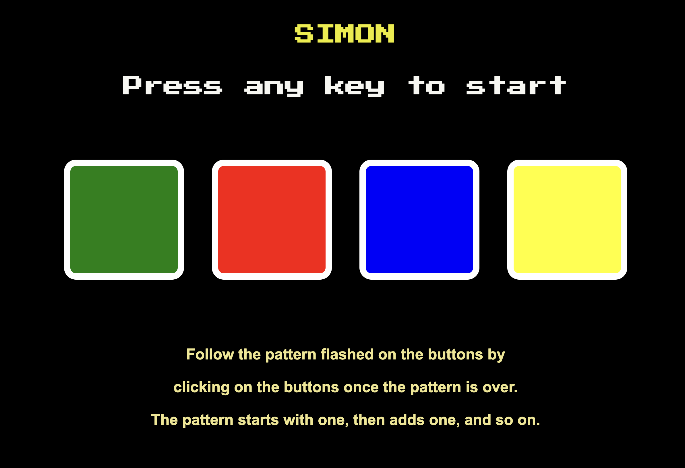
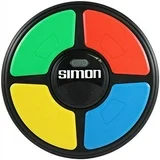
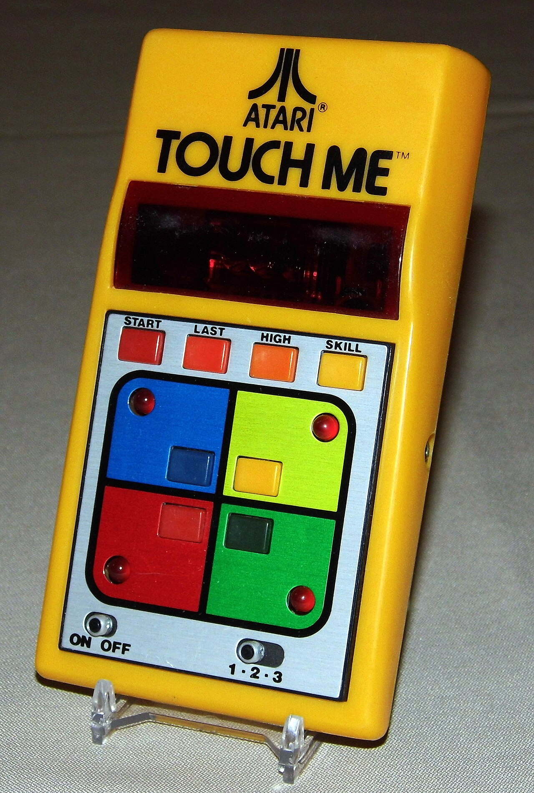

# SIMON 

## Game Inspiration:

The game was made in 1978 by Ralph Baer for the Milton Bradley Company. His inspiration was copied by an Atari arcade game call "Touch Me" which was supposed to be the electronic version of the kids game Simon Says. The handheld game was to be called Simon. 

https://americanhistory.si.edu/collections/object/nmah_1302005

I never owned one of these games but my parents bought one for themselves when I was about 6. Even though it was not mine I played it for hours. I can not remember how high of a level I ended up on, but I remember the simplicity but fascination for the game. Hench my reason for build a web based one.

## Instructions

Press start to begin.

Repeat the random sequences of lights and sounds by pressing (clicking) the button on screen. The computers sequence starts with one and increases by one each successful turn. 

Get to level 10 and You Win!

If you don't get the sequence correct You Lose, and the same starts over. 

## Next Steps

Make the buttons circular like the original game. 

Give the user a chance to select level of difficulty. 

## Technologies used
HTML
CSS
Javascript
Github

### Links

github repo

https://github.com/hueckert/game-simon.git

deplay link:

https://hueckert.github.io/game-simon/

